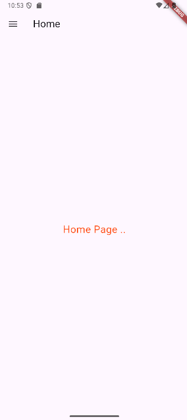
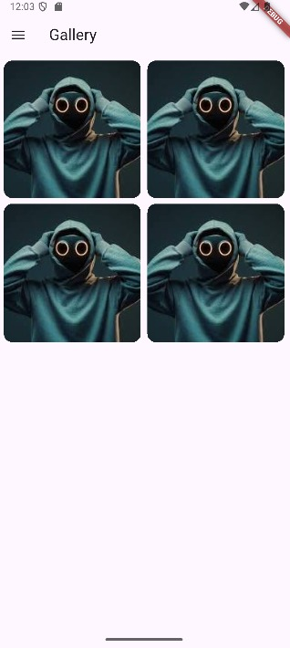
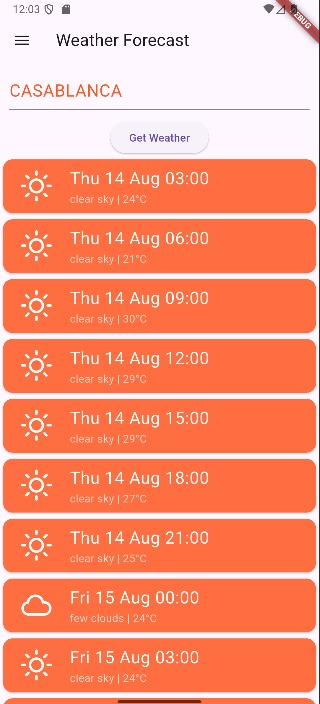

# Weather App

## Screenshots

### Main Interface & Navigation

  
  
   
  <b>Left:</b> App Sidebar &nbsp;&nbsp; <b>Right:</b> Home Screen

### Feature Pages

  
  
  
  
   
  
    <b>Counter Widget</b> &nbsp; | &nbsp;
    <b>Contact Management</b> &nbsp; | &nbsp;
    <b>Photo Gallery</b> &nbsp; | &nbsp;
    <b>Weather Dashboard</b>
  

